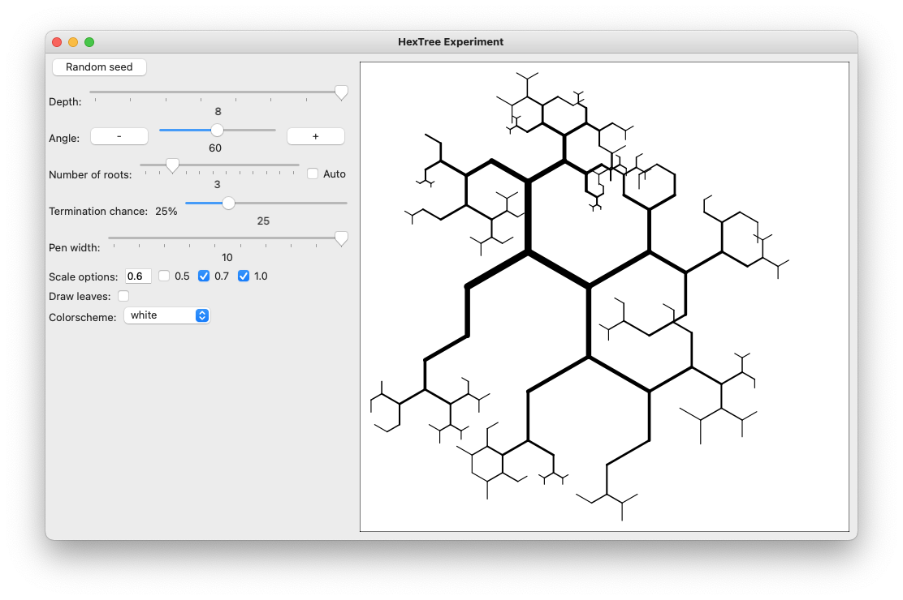

An interactive tool for drawing
[fractal binary trees](https://en.wikipedia.org/wiki/Fractal_canopy)
([L-systems](https://en.wikipedia.org/wiki/L-system#Example_2:_fractal_(binary)_tree))
with the
[Racket](https://racket-lang.org/)
[turtles library](https://docs.racket-lang.org/turtles/index.html).
Watch a [demo on youtube](https://youtu.be/pBRktdJCIPo).

Took inspiration from [this blog post](https://www.leonrische.me/pages/generative_art_with_cfgs.html).