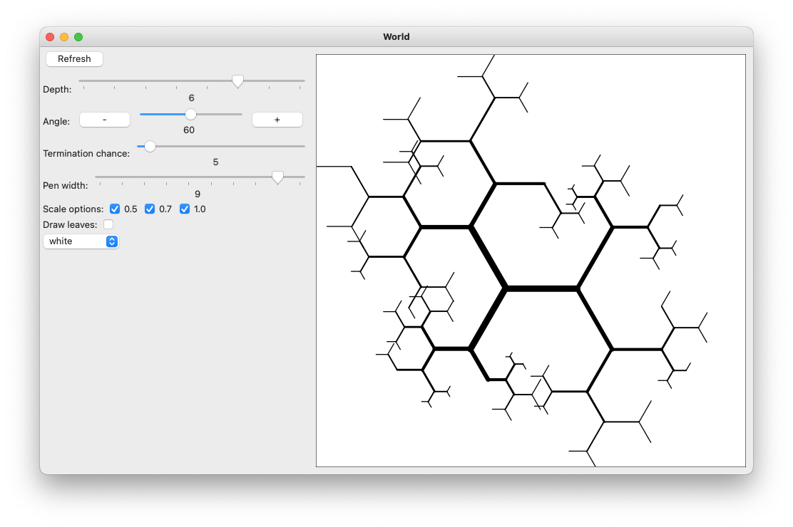

Drawing [fractal binary trees](https://en.wikipedia.org/wiki/L-system#Example_2:_fractal_(binary)_tree) (L-systems)
with the [Racket turtles library](https://docs.racket-lang.org/turtles/index.html).

Took inspiration from [this blog post](https://www.leonrische.me/pages/generative_art_with_cfgs.html).